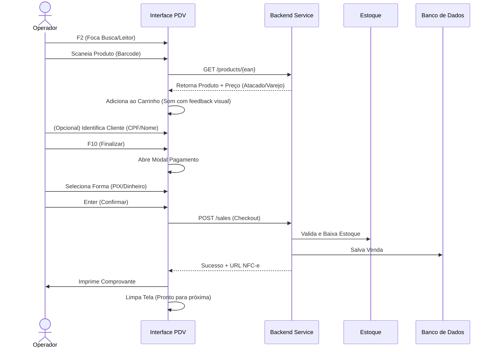
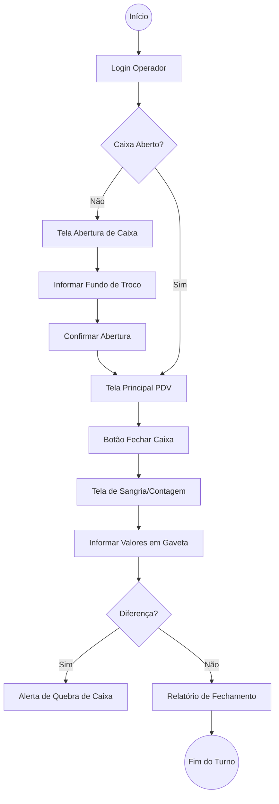

# Fluxo de Telas (User Flows) - Adega dos Cometas

## 1. Fluxo Principal: Realizar Venda (PDV)
Este é o fluxo mais crítico, focado em **Velocidade**.

## 2. Fluxo: Abertura e Fechamento de Caixa
Essencial para o controle financeiro.

